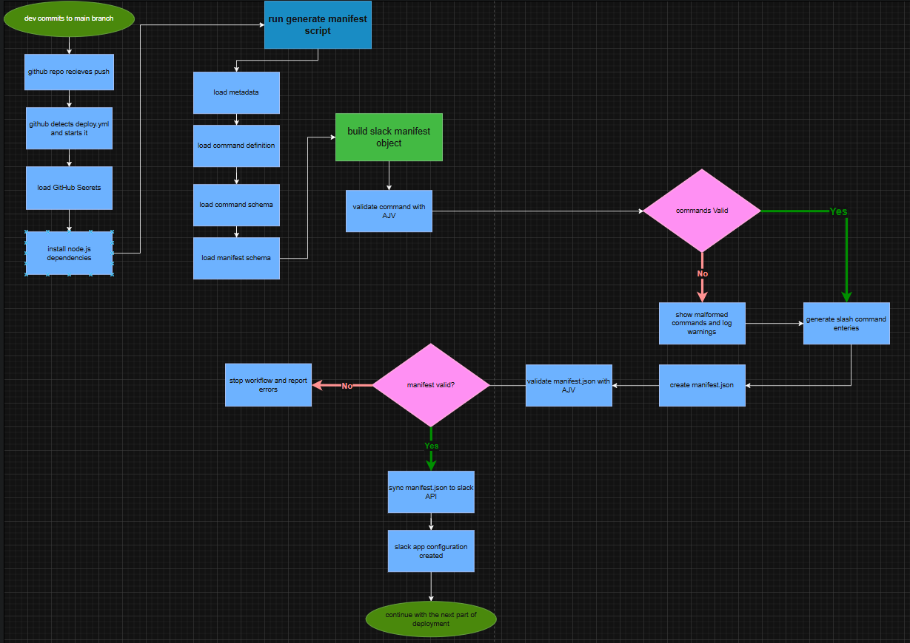

# Devlog 5 - manifest workflow
time logged: 4hrs 57mins
date: 21/07/2026

today i focused on automating another part of Slackzilla's deployment pipeline. previously, the slack app manifest had to be maintained manually whenever i added or changed slash commands. It worked, but it was another file that could easily fall out of sync with the actual bot. instead, i made `commands.json` and `meta.js` the source of truth and wrote a manifest generator that builds `manifest.json` automatically from those files. The generator validates the command definitions, reads all of the metadata required for the Slack app such as descriptions, colours, OAuth scopes and bot information, then produces a complete manifest ready to upload.

one thing i wanted to avoid was silently generating a broken manifest. To solve that, i added schema validation directly into the generator using AJV. Every command is validated against `command.schema.json` before it is included, and once the manifest has been assembled it is validated again against Slack's manifest schema. If something is invalid, the generation process immediately exits with a clear error instead of producing an invalid file.

while working on this, i also cleaned up the project structure. The JSON schemas no longer live inside `src/data` and instead have their own `schemas/` directory alongside the manifest schema. after that i updated my GitHub Actions workflow. Every push now generates the manifest, validates it and synchronises it with the Slack app using the Manifest API before deploying the bot. This means changing a slash command in commands.json is enough to update both the bot and the Slack application configuration without editing multiple files.

the hardest part today was figuring out Slack's manifest tokens. Unlike most API tokens, the configuration access token only lasts for 12 hours, so simply storing it in GitHub Secrets wasn't going to work. I ended up digging through both the Slack and GitHub documentation to automate the whole process. Since the workflow needs to update its own GitHub Secrets after every rotation, i had to create a fine grained GitHub Personal Access Token (PAT) with permission to modify repository secrets. After understanding how Slack's refresh token system works, i started writing `rotateManifestToken.js`, which rotates the manifest token, receives a brand new refresh token at the same time, and updates both secrets ready for future deployments.

i also spent some time fixing validation issues with AJV. The CLI and the library were using different versions, which resulted in some confusing Draft-07 schema errors. After a bit of debugging i aligned everything so the manifest now validates correctly both locally and in CI.

while testing the token rotation workflow, i ended up chasing an `invalid_refresh_token` error for quite a while. It turned out the issue wasn't the code at all, but my misunderstanding of how Slack's configuration tokens work. I assumed the Copy button simply copied the existing refresh token, but it actually generates a fresh token pair. That meant every time i clicked Copy, the previously saved refresh token immediately became invalid. After realising what was happening, i started updating the GitHub Secrets immediately after copying the new token pair so they always stayed in sync.

overall, today's work wasn't about adding flashy new commands. Instead, it was about making the development workflow itself more reliable. The less manual configuration there is, the less chance there is for things to drift out of sync or for me to accidentally deploy something broken.

TL;DR: Slackzilla now automatically generates its Slack manifest from the project's metadata, validates it with JSON Schema, and syncs it during deployment. I also started automating Slack manifest token rotation so the deployment pipeline can eventually maintain itself with minimal manual intervention (apart from refreshing the GitHub PAT every 90 days).

---

<a href="devlog4.md">
  <picture>
    <source media="(prefers-color-scheme: dark)" srcset="https://cdn.hackclub.com/019c1b78-0beb-7c82-9479-51e12c90a5b4/image.png">
    
  </picture>
</a>

  <em>
    <b>
      <a href="#">
        visit non existent devlog 6 (coming soon)
      </a>
    </b>
  </em>

