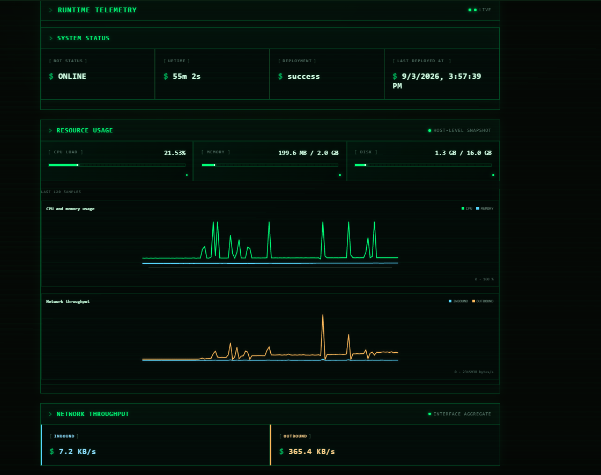

  

# Devlog 9: React Dashboard
time logged: 29hr 1m
date: 03/09/2026

The React dashboard is finally here! I completely migrated the old EJS dashboard with a new React app. THIS ~will be~ IS the biggest devlog yet, as it covers a lot of changes and new features. main features added is migration, codebase assistance, graphs, telemetry and a new api.

Heres a summary of what i changed

* renamed `src/` to `bot/` - this is because its related to the bot and not the server and its not where all the main files are
* migrated the EJS dashboard into a React app
* overhauled the UI
* deleted the pages system and the workflow to build it
* added a new RAG modal that answers questions about the repo and shows related visual assets (also includes a new `rag.js` file that handles retrieval and generation of answers)

The react dashboard has the following features:

* 10 pages (Home, Admin, Api, Commands, Docs, Home, Logs, AI, Sitemap, Status)
* 12 components
* 8 utilities js exports in the `utils/` folder
* 404 page (with routing) & Error Boundary modal page
* public AI assistant page with repository-aware retrieval and related visual assets
* command API with stable IDs, command help, and captured command responses (so API can be called from the dashboard)
* public status, logs, metrics, command, and AI API endpoints
* admin feedback controls for filtering, viewing, replying, marking read/unread, and deleting (they dont work on windows only linux)
* CPU, memory, disk, and network telemetry with responsive graphs and hover data tooltips (so satisfying)

## Current React Architecture

The active client source lives in `server/client/src/`. Vite builds it into `server/client/dist/`, which is served by `server/server.js`. React Router renders the page routes declared in `server/client/src/components/utils/routes.js`. The server still owns the HTTP status code: known browser routes receive the React shell with `200`, while unknown browser routes receive the same shell with `404` so the client can render the NotFound page without hiding the correct HTTP semantics.

The old EJS dashboard and static page-generation flow are no longer the active dashboard path. The bot remains in `bot/`, separate from the dashboard server, and the server uses explicit Node `http` handlers under `server/api/`.

## RAG and Command APIs

The new `/ai` page sends questions to `POST /api/ask`. `server/lib/rag.js` retrieves relevant repository text while excluding `priv/`, `.env` files, dependencies, logs, and build output. It can identify related image assets such as the calculator flowchart without parsing binary image contents. If configured, the retrieved context is sent to the AI provider; otherwise the endpoint returns a local configuration message and source metadata.

Commands are exposed through `GET /api/commands`, `GET /api/commands/:id`, and `POST /api/commands/:id`. The API adapter reuses the same command modules as Slack and captures their responses. The Commands page provides the interactive runner, while the AI page remains focused on repository questions. Explicit natural-language requests can still ask the RAG service to execute a recognised slash command and return its result.

## Limitations

The migration exposed several boundaries that are now documented in `docs/`: authentication and CSRF, the webhook protocol, API registration, setup, and RAG behaviour. Runtime persistence is still file-backed through `server/database/store.js`; an external database remains a future adapter project rather than a required dependency.

Linux systemd controls and deployment scripts are intended for the hosted environment. On Windows local development, the dashboard, APIs, telemetry, and React pages work, but system service actions and Bash deployment are not expected to succeed. The dashboard must be rebuilt and restarted after production client or server changes.

---

<a href="devlog8.md">
  <picture>
    <source media="(prefers-color-scheme: dark)" srcset="https://cdn.hackclub.com/019c1b78-0beb-7c82-9479-51e12c90a5b4/image.png">
    
  </picture>
</a>

  <em>
    <b>
      <a href="devlog10.md">
        visit devlog 10
      </a>
    </b>
  </em>

  <em>
    <b>
      <a href="https://rylvion.hackclub.app/ai" target="_blank">
        visit ai assistant and react dashboard (hosted)
      </a>
    </b>
  </em>

