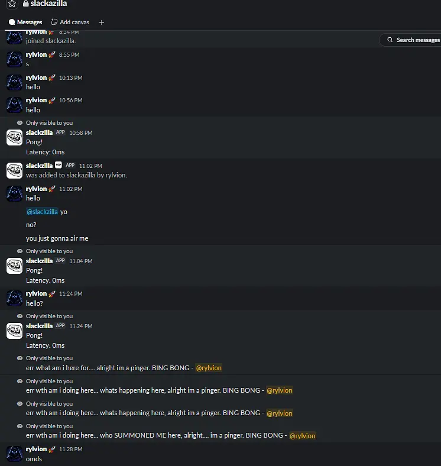
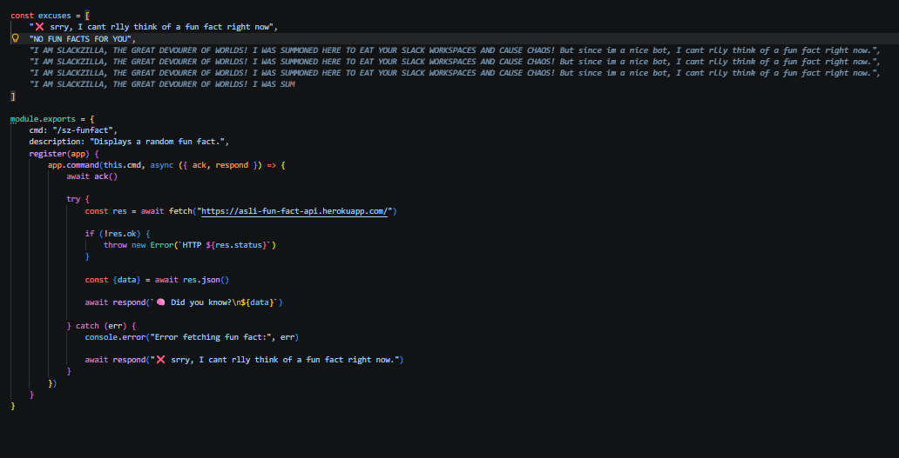
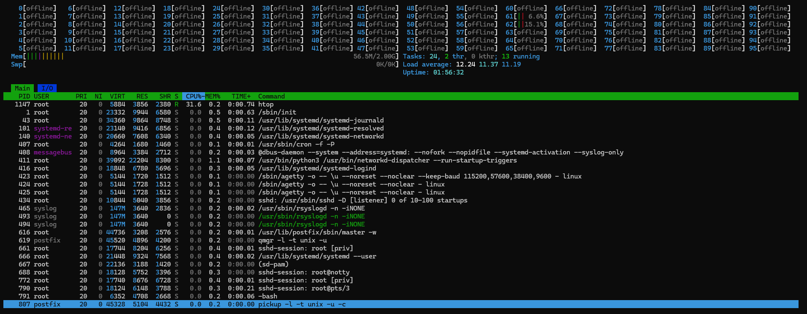
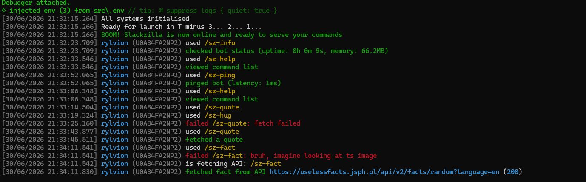
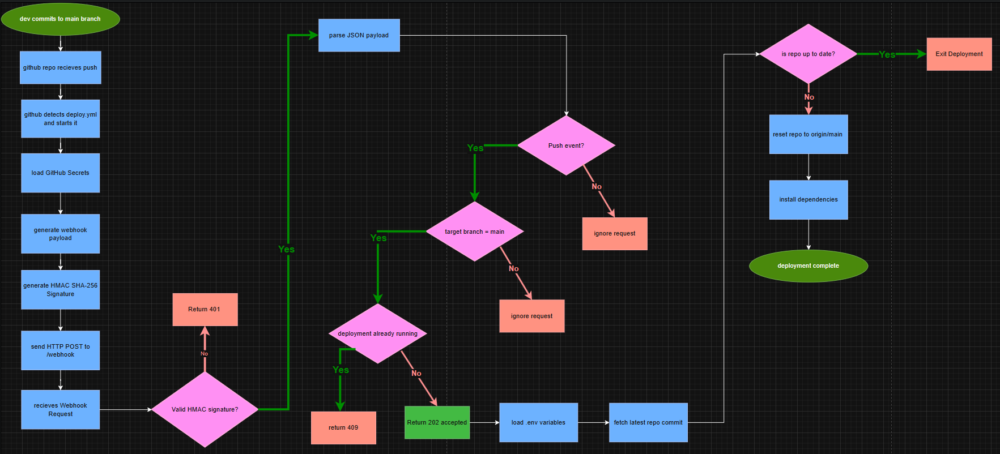
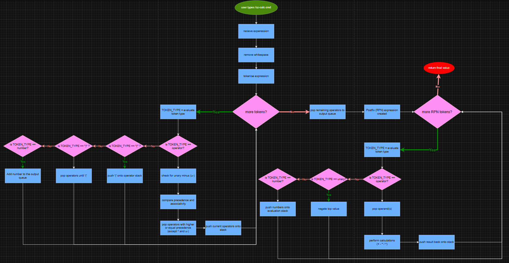
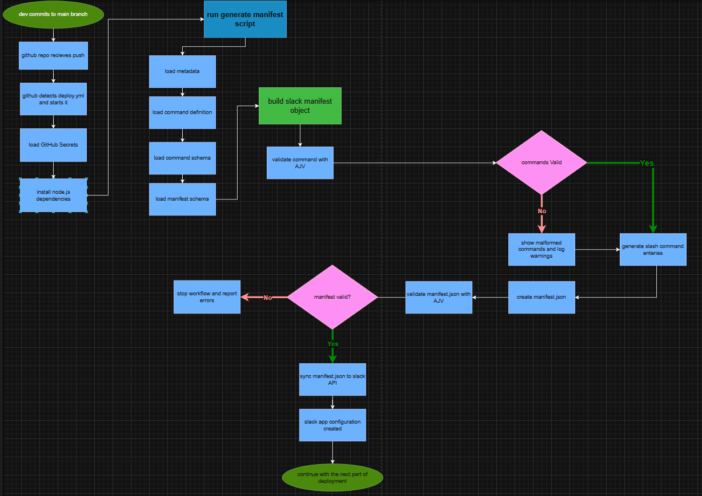
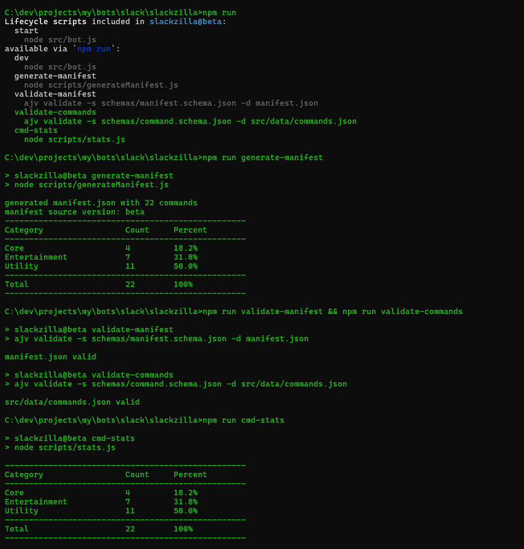
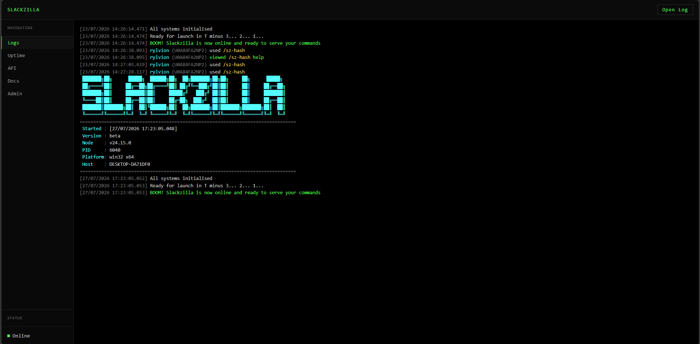
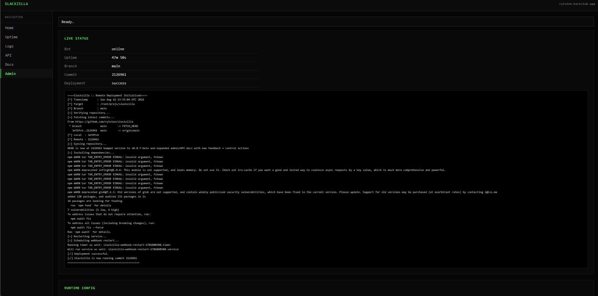

# TOC

- [Devlog 1: Initial Setup](./devlog1.md)
- [Devlog 2: Server Setup and Modular Command System](./devlog2.md)
- [Devlog 3: Github Actions Webhook](./devlog3.md)
- [Devlog 4: Calculator and roll command](./devlog4.md)
- [Devlog 5: Manifest Workflow](./devlog5.md)
- [Devlog 6: Command Updates](./devlog6.md)
- [Devlog 7: Github Pages Prototype](./devlog7.md)
- [Devlog 8: Server Hosted Dashboard](./devlog8.md)

## Assets

### [Devlog 1: Initial Setup](./devlog1.md)
Summary: Created the initial setup for the Slack bot project, including basic command handling

  

### [Devlog 2: Server Setup and Modular Command System](./devlog2.md)
Summary: Set up the nest server to make the bot run 24/7 and made commands into multiple files so they are modular 

  
  
  

### [Devlog 3: Github Actions Webhook](./devlog3.md)
Summary: Added a webhook that when commited/pushed to main branch, it will trigger a workflow that will send a request and the bot catches it and pulls latest changes and restarts the bot,

  

### [Devlog 4: Calculator and roll command](./devlog4.md)
Summary: Added a calculator command that can evaluate mathematical expressions with the Shunting Yard algorithm (with postfix evaluation) and a roll command that can roll dice with a standard domain-specific-language (DSL) using dice notation syntax like `2d6+3` or `d20-1`. also added help commands for these 2 utilities, added flowcharts and automated JSON schema validation.

  

## [Devlog 5: Manifest Workflow](./devlog5.md)
Summary: Added a manifest generator that auto generates the slack manifest from `commands.json` and `meta.js`, validates everything with AJV, rotates configuration tokens, syncs the manifest during deployment and updates the bot server with minimal manual work.

  

## [Devlog 6: Command Updates](./devlog6.md)

Summary: Added 11 new commands (10 utility + 1 entertainment), doubling the total number of commands from 11 to 22. Also added two new `package.json` scripts: one for validating commands.json and one for generating command statistics.

  

## [Devlog 7: Github Pages Prototype](./devlog7.md)
Summary: Added a prototype view of the web dashboard for slackzilla, its hosted on [Github Pages](https://rylvion.github.io/slackzilla/) and is a static site that is not connected to the bot yet, it shows the design and layout of the dashboard and how it will look when its connected to the bot. The dashboard is designed to be a retro terminal hacker style

  

## [Devlog 8: Server Hosted Dashboard](./devlog8.md)
Summary: Added a server hosted dashboard for slackzilla, it is hosted on the same server as the webhook and is connected to the bot, it shows the logs, status, and other information about the bot.

  

---

- [Devlog 1: Initial Setup](./devlog1.md)
- [Devlog 2: Server Setup and Modular Command System](./devlog2.md)
- [Devlog 3: Github Actions Webhook](./devlog3.md)
- [Devlog 4: Calculator and roll command](./devlog4.md)
- [Devlog 5: Manifest Workflow](./devlog5.md)
- [Devlog 6: Command Updates](./devlog6.md)
- [Devlog 7: Github Pages Prototype](./devlog7.md)
- [Devlog 8: Server Hosted Dashboard](./devlog8.md)

---

  <em><b>
    <a href="https://stardance.hackclub.com/projects/4967" target="_blank">
      visit stardance devlogs
    </a>
  </b></em>

