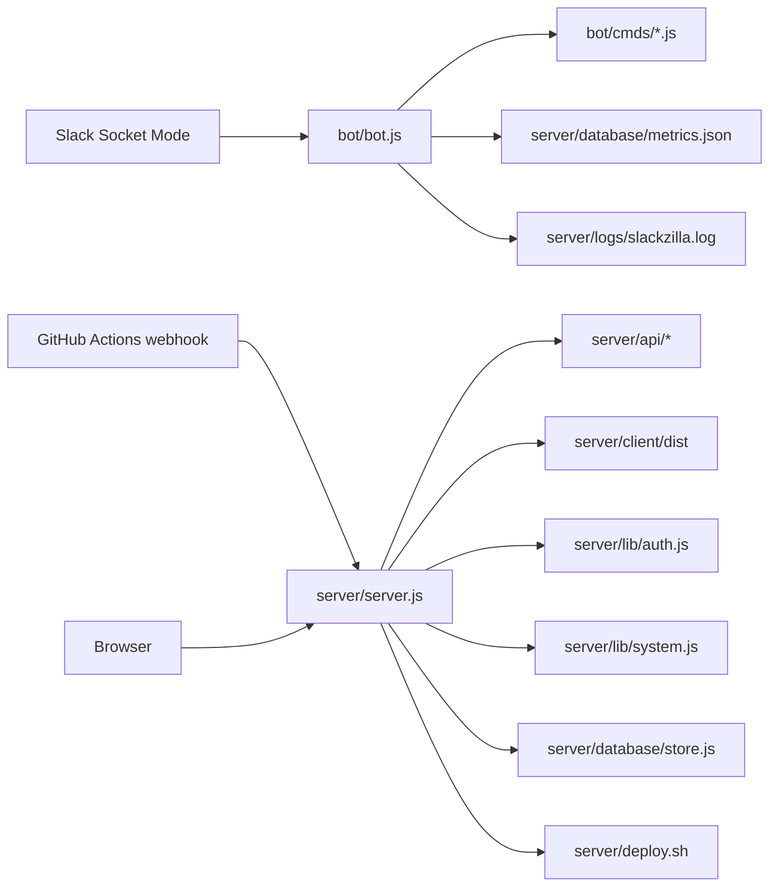

# Slackzilla Architecture

This document describes the active architecture in this repository. Slackzilla uses two Node.js processes and a shared file-backed store. It does not use Express, a database server, or automatic module discovery.

## System Boundary

The bot maintains the Slack connection and executes commands. The dashboard server provides HTTP pages, APIs, authentication, telemetry, logs, and deployment handling. Both processes can read and write shared files under `server/database/` and `server/logs/`.

## Repository Layout

| Path | Responsibility |
| --- | --- |
| `bot/bot.js` | Creates the Slack Bolt Socket Mode app and loads commands. |
| `bot/cmds/` | Command implementations registered with `app.command()`. |
| `bot/data/commands.json` | Command metadata and usage hints. |
| `bot/utils/` | Bot logging, fetching, command loading, and metrics adapters. |
| `server/server.js` | HTTP server, request dispatch, static files, APIs, pages, webhook, and SSE. |
| `server/api/` | Explicit API handler modules. |
| `server/lib/auth.js` | Password verification, login challenges, sessions, cookies, and CSRF. |
| `server/lib/system.js` | CPU, memory, disk, network, Git, service, and deployment helpers. |
| `server/database/store.js` | File-backed persistence adapter. |
| `server/client/src/` | React dashboard source. Vite outputs `server/client/dist/`. |
| `assets/attachments/` | Repository images and flowcharts served as visual assets. |

## Process Lifecycle

`npm start` builds and lints the dashboard, then starts the bot and dashboard concurrently. Production service files run them separately: `slackzilla.service` starts the bot and `slackzilla-webhook.service` starts `server/server.js`. (this should be for development only, not production), it should use actual service files for production. 

The bot connects to Slack through Socket Mode using `SLACK_APP_TOKEN` and authenticates Web API calls with `SLACK_BOT_TOKEN`. The dashboard listens on `PORT`, normally `9000`, and serves browser traffic and the GitHub webhook. A reverse proxy can expose that one port over HTTPS.

## HTTP Request Dispatch

The server uses Node's `http.createServer()`. `handleRequest()` parses the URL, applies security headers, and checks handlers in this order:

1. `handleStatic()` serves built assets and repository attachments.
2. `handleWebhook()` verifies and processes GitHub webhook requests.
3. `handleAdminLogin()` handles the login challenge and credential exchange.
4. `handleApi()` asks each API module whether it owns the request.
5. `handleReactApp()` serves the React `index.html` for browser routes.
6. Unmatched requests receive `404 Not found`.

An API module receives `{ req, res, url, context }`. It checks both `url.pathname` and `req.method`, sends a response, and returns `true` when it handled the request. It returns `false` when another handler should continue. API modules are imported and called explicitly in `server.js`.

Successful JSON responses normally use `{ ok: true, data }`; errors use `{ ok: false, code, error }`. `parseBody()` accepts JSON and URL-encoded form data. SSE handlers keep a response open and use `sendSse()` to emit named events.

## React Request Flow

The browser loads `server/client/dist/index.html`, then React Router selects a page from `server/client/src/components/utils/routes.js`. Pages use `PageShell` for the header, navigation, and content area. API requests use `fetch()` or `getJson()`. Status and admin pages subscribe to SSE streams for updates.

A React route and a backend route are separate. The React route decides which component renders in the browser; the server handler decides which HTTP request is served. The frontend API registry documents endpoints but does not mount them.

## Data Flow and Storage

`server/database/store.js` is an adapter-shaped module implemented with JSON files:

- `metrics.json`: command totals, users, channels, recent command events, and bounded server request events.
- `bot-state.json`: bot heartbeat, PID, version, platform, and status.
- `feedback.json`: feedback entries and response state.
- `deployment.json`: deployment status, commit, output, and result.
- `server/logs/slackzilla.log`: raw terminal-style log output.

Writes are synchronous read-modify-write operations. This is simple for a small self-hosted deployment, but it is not transactional storage under high concurrency. A future database adapter should preserve the store function API and add migrations, indexes, retention, and atomic writes.

## Telemetry

The dashboard refreshes runtime telemetry once per second. CPU is calculated from Node process CPU deltas divided by elapsed wall time and normalised by CPU core count. Host memory uses `os.totalmem()` and `os.freemem()`. Disk uses `fs.statfsSync()` with fallback paths. Linux network counters come from `/proc/net/dev`; Windows counters come from `netstat -e`.

The server keeps the latest 120 samples in memory for charts. Bot command events and server request events are persisted and capped at 1,000 entries. These limits prevent unbounded memory and file growth.

## Deployment

The GitHub webhook and dashboard share the server process. A valid push event for the configured branch is acknowledged, recorded as queued, and passed to `server/deploy.sh`. Deployment output and final state are stored and broadcast to connected admin clients through SSE.

The webhook is not a general command endpoint. It accepts the expected event shape, verifies its HMAC signature, checks the configured branch, and invokes the deployment script. See [webhook.md](webhook.md) for the protocol.

## Extension Rules

For a new Slack command, update `bot/data/commands.json` and add the implementation in `bot/cmds/`. For a new HTTP API, create a handler under `server/api/`, import it in `server/server.js`, add it to `handleApi()`, document it in `server/client/src/components/utils/api-routes.js`, and add a schema if useful. For a new browser page, add the component under `server/client/src/pages/` and a route entry.

The codebase assistant retrieves text files outside `priv/`, identifies image assets without reading binary contents, and executes a command only when the request explicitly names a recognised command.
