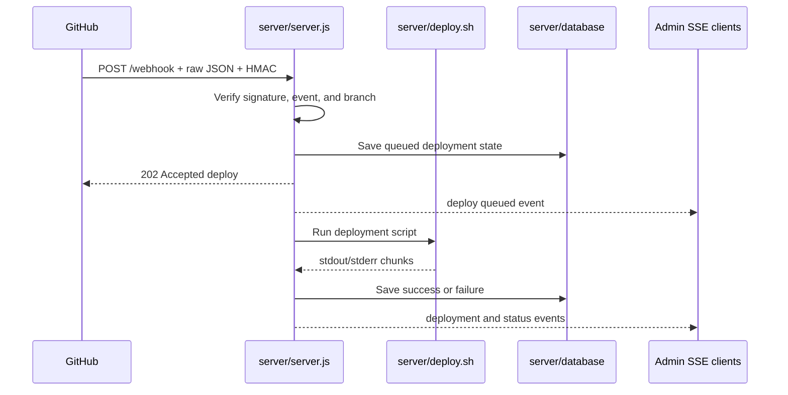

# GitHub Webhook and Deployment Guide

Slackzilla's webhook is hosted by `server/server.js` at `POST /webhook`. It shares port `9000` with the dashboard and APIs.

## Request Contract

GitHub sends a JSON body and these important headers:

- `X-GitHub-Event`: expected to be `push`.
- `X-Hub-Signature-256`: `sha256=<hex digest>` HMAC signature.
- `Content-Type`: normally `application/json`.

The server reads the raw request bytes before parsing JSON. HMAC verification must use the exact bytes GitHub signed, not a re-serialised object.

## HMAC Verification

The server computes:

```text
expected = "sha256=" + HMAC-SHA256(WEBHOOK_SECRET, raw request body)
```

It compares the expected and supplied values using a constant-time comparison after checking equal length. Missing or invalid signatures receive `401 Invalid signature`.

`WEBHOOK_SECRET` in `server/.env` must exactly match the GitHub secret used to generate the signature. Rotating it requires updating both locations and restarting the service.

## Event and Branch Filtering

After signature verification, the body is parsed as JSON. Invalid JSON receives `400`. Events other than `push` receive `202` and do not deploy.

The configured branch is `BRANCH`, defaulting to `main`. The server expects `payload.ref` to equal `refs/heads/<BRANCH>`. Other branches receive `202` and do not invoke the deploy script.

## Deployment Sequence



The server records the deployment as queued, sends an early `202`, and runs `server/deploy.sh`. Output is stored and broadcast to connected admin clients. Success records the commit, timestamp, output, and result; failure records the error and failed state.

## GitHub and Proxy Configuration

Configure the webhook or workflow with:

```text
WEBHOOK_URL=https://your-domain.example/webhook
WEBHOOK_SECRET=<same value as server/.env>
```

The reverse proxy must preserve the request body and `X-Hub-Signature-256` header. Do not parse and rewrite the body before forwarding it.

## Local Testing

An unsigned request should fail:

```bash
curl -i -X POST http://localhost:9000/webhook \
	-H "X-GitHub-Event: push" \
	-H "Content-Type: application/json" \
	-d '{"ref":"refs/heads/main"}'
```

To test a valid request, calculate the HMAC over the exact body bytes with `WEBHOOK_SECRET`, then send the `sha256=...` value in `X-Hub-Signature-256`. Test a non-release branch first so deployment is not invoked.

## Failure Diagnosis

| Symptom | Likely cause |
| --- | --- |
| `401 Invalid signature` | Secret mismatch, changed body, missing header, or proxy removed the signature. |
| `400 Invalid JSON payload` | Body is not valid JSON. |
| `202 Ignored non-push event` | GitHub sent another event type. |
| `202 Ignored push for ...` | `payload.ref` does not match `BRANCH`. |
| Deployment failed | Inspect `server/logs/slackzilla.log` and `deployment.json`; check Git, permissions, paths, and shell commands. |
| GitHub timeout | Inspect deployment state; the server acknowledges before the script completes. |

The webhook service user needs access to the working tree, Git credentials, deployment script, and required system commands.

## What does `deploy.sh` do?
The deployment script is responsible for fetching the latest code, building the project, and restarting services in a safe, automated sequence. It runs only after the webhook server has validated the GitHub push event and confirmed the branch matches the configured deployment branch. it does the following:

* ensures the local repository matches the remote branch
* installs dependencies and builds the React client
* restarts the main Slackzilla service, Nginx, and schedules a safe restart of the webhook service
* skips deployment entirely if no new commits exist


## Summary
it makes slackzilla automatically be up to date after every commit and makes it easier to deploy slackzilla without having to manually do it